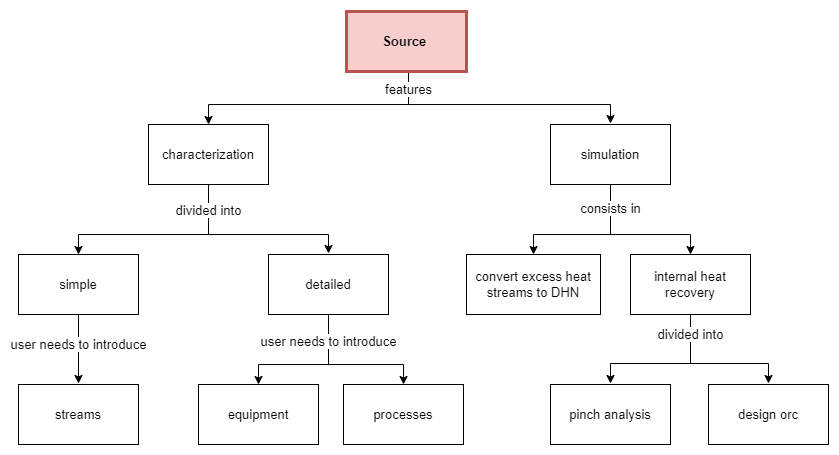

Source Submodule
=====================

The CF source submodule is divided into: characterization and simulation.

 **The characterization is responsible for receiving the input data from the user, and, by performing several computations, to assess and estimate the available excess heat streams.**

*Simple*: The user directly introduces the streams, its properties and schedule

*Detailed*:  The user must provide the processes and equipment data so that the CF module can obtain the key streams to be assessed.

**The simulation aims to evaluate the recovery of the available excess heat internally, either by integrating it within the source's processes – pinch analysis - or by implementing an Organic Rankine Cycle (ORC); and externally, by converting it to the DHN.**

*INTERNAL HEAT RECOVERY*: Consists in recovering the heat within the industry by designing a network of heat exchangers – applying the pinch analysis -  that promotes the exchange of heat within the processes, thus, minimizing heat/cooling supply by external equipment; by utilizing the excess heat to produce electricity – implementing an Organic Rankine Cycle (ORC).

*CONVERT DHN*:It aims to design and estimate the costs of converting the available heat of its excess heat streams to the District Heating Network - DHN. For each excess heat stream available the conversion technologies are designed, e.g. a heat exchanger to recover the heat from a hot stream and supply it to the DHN.

|

.. toctree::
   :maxdepth: 4
   :caption: Submodules:

   Source Characterization
   Source Simulation

